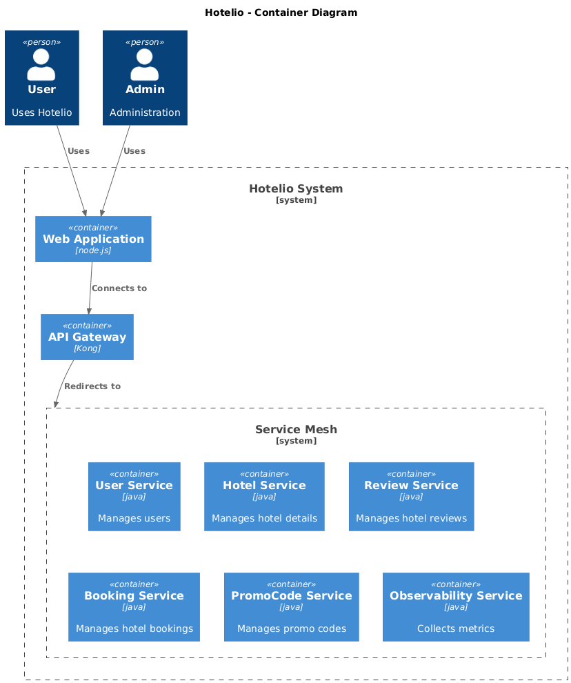
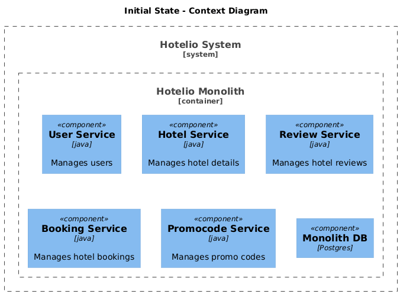
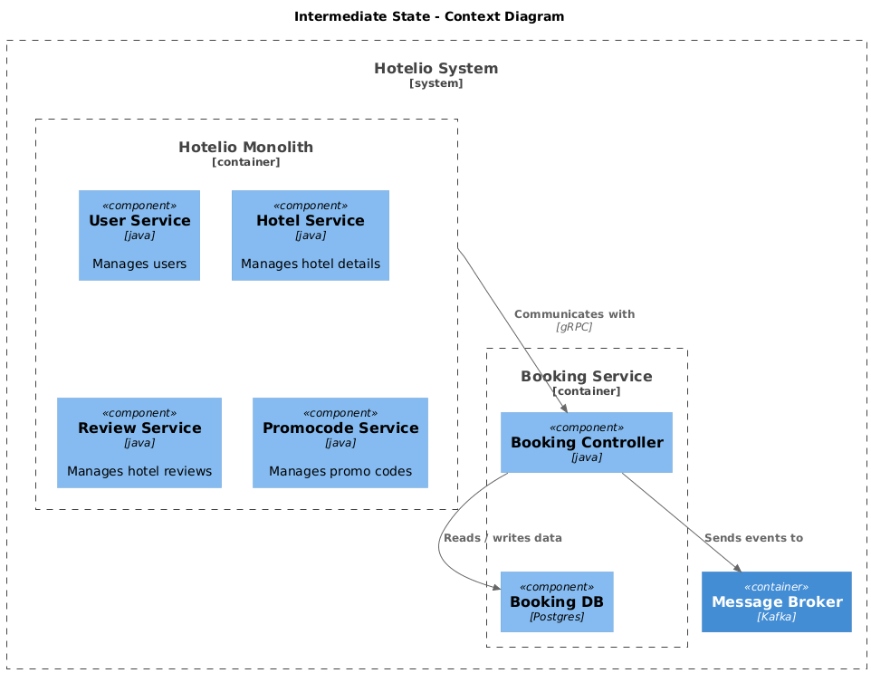
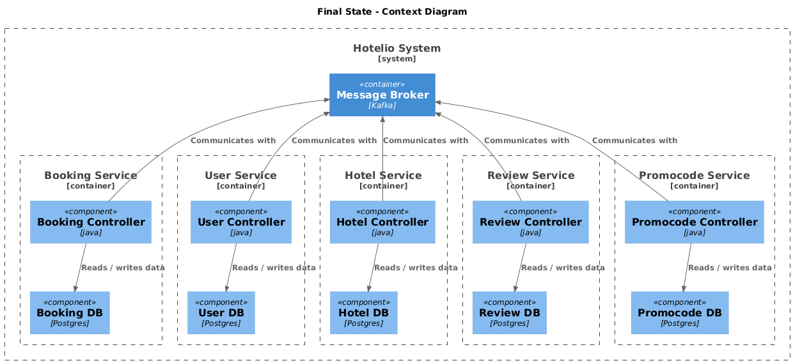

### Документ: ADR_01

### Название задачи: Архитектурный анализ и план миграции на микросервисы.

### Автор: Егоров Антон.

### Дата: 20.11.2025

### Проблема

Сервис Hotelio реализован как единое приложение, в котором все бизнес-функции собраны в одном коде, разворачиваются как единый сервис и используют одну базу данных.

С ростом бизнеса возникли серьёзные архитектурные и операционные проблемы. Команда приняла решение о переходе на микросервисную архитектуру с постепенным выносом сервисов.

#### Текущие проблемы
- Сложность сопровождения
  - Любое изменение требует понимания всей кодовой базы.
  - Невозможно менять один модуль, не затрагивая другие.
- Низкая масштабируемость
  - При пиковых нагрузках (например, на бронирование) нельзя масштабировать только нужный компонент.
  - Производительность неравномерна.
- Невозможность гибкой разработки
  - Разные команды не могут работать независимо.
  - Трудно внедрить быстрый CI/CD.
- Ограничения на фронтенде
  - REST API монолита слишком универсален и плохо адаптируется под разные платформы.
  - Нет поддержки BFF.
- Сложности с запуском новых фич
  - Большой риск ошибок из-за плотной связанности.
  - Тестирование требует понимания всех зависимостей.

### Цели бизнеса

Начать поэтапный переход к микросервисной архитектуре, применяя паттерн Strangler Fig, — выносить по одному компоненту, оставляя остальной функционал в монолите. Это позволит упростить масштабирование, снизить время выхода фич, повысить отказоустойчивость и упростить независимую разработку разных команд.

#### Финальное целевое состояние через год:
- Полный переход на микросервисную архитектуру.
- Service mesh с автоматизированными rollouts.
- Масштабируемая Kafka-инфраструктура.
- Метрики и трассировка на каждый сервис.
- GraphQL для фронтенда.

### Функциональные требования

| **Код** | **Система должна** |
| :-: | :- |
| F1 | Предоставлять список отелей с описанием |
| F2 | Предоставлять возможность посмотреть отзывы по отелям |
| F3 | Предоставлять возможность забронировать отель |
| F4 | Предоставлять клиентам промокоды |

|**№**|**Use Case**|**Действующие лица или системы**|**Требования**|**Шаги**|
| :-: | :- | :- | :- | :- |
| 1 | Просмотр списка отелей | Пользователь | F1 | 1. Пользователь открывает сайт отелей. 2. Система выдаёт список отелей с информацией о каждом и отзывами |
| 2 | Оставление отзывов на отели | Пользователь | F2 | 1. Пользователь открывает сайт отзыва об отеле. 2. Пользователь вводит отзыв. 3. Система сохраняет отзыв |
| 3 | Бронирование отеля | Пользователь | F3 | 1. Пользователь открывает сайт отеля. 2. Пользователь вводит детали бронирования и нажимает "забронировать". 3. Система валидирует корректность введённых данных и доступность выбранного бронирования. 4. Система бронирует выбранный отель для данного пользователя. |
| 4 | Бронирование отеля | Пользователь, Администратор | F4 | 1. Администратор задаёт промокод для выбранного пользователя / группы пользователей / отеля / группы отелей. 2. Пользователь вводит промокод при бронировании. 3. Система валидирует введённый промокод. 4. Пользователь видит скидку по промокоду и бронирует отель. 5. Система применяет скидку. |

### Нефункциональные требования

| **Код** | **Система должна** |
| :-: | :- |
| R1 | Система должна обеспечивать достаточно высокую отказоустойчивость 99,95% |
| S1 | Система должна быть расширяемой, то есть иметь возможность разработать новый функционал без изменений существующего |

### Решение

Проивзодить миграцию системы предлагается поэтапно. Финальное (целевое) видение системы:

Одновременная миграция всех компонентов в сервисы не представляется возможной в виду большого риска и необходимости продолжать разработку / доставку новых фич в процессе миграции. Для минимизации риска принято решение использовать паттерн Strangler Fig - постепенный перенос компонентов с сохранением работоспособности всей системы.

#### План миграции:

Ниже преведены контекстные диаграммы начального состояния, промежуточного (через пару месяцев), и финального состояния

Начальное состояние

Промежуточное состояние

Финальное состояние
